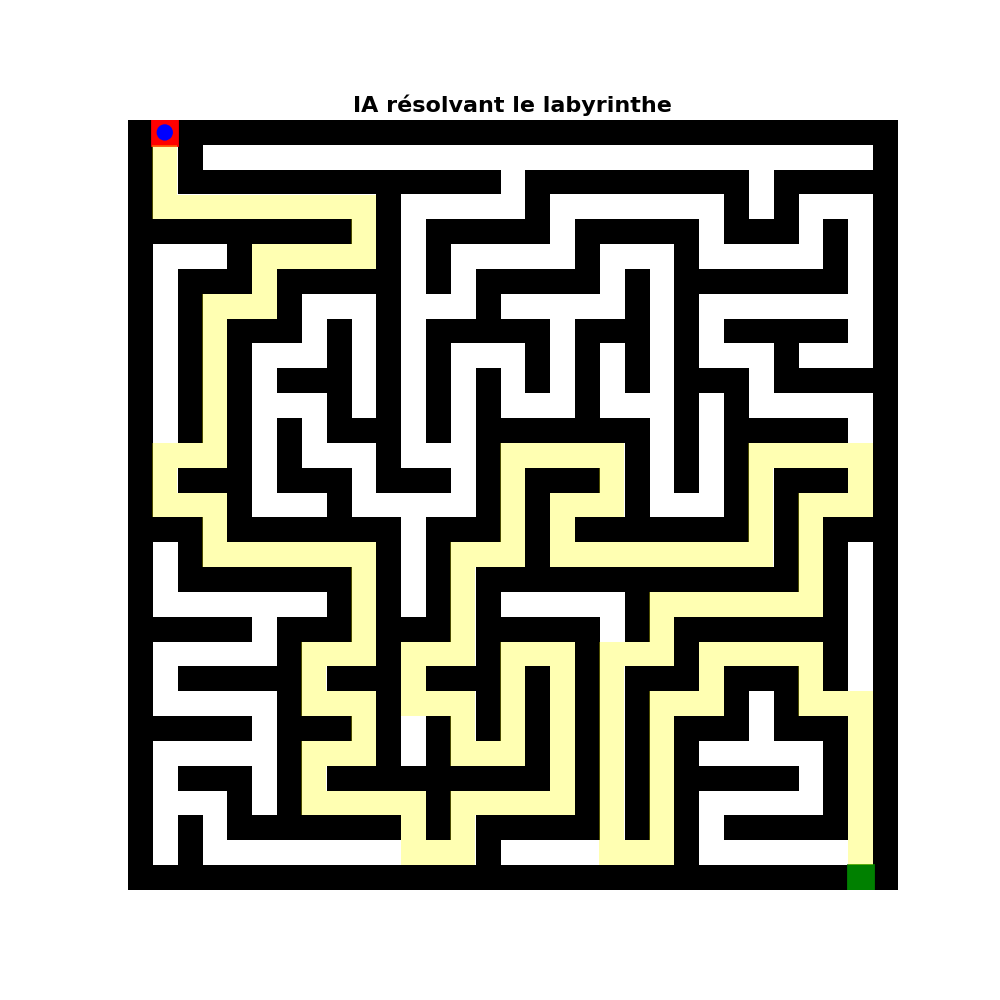

python maze_solver.py
```

## 📊 Résultat



L'animation montre :
- 🔴 Point de départ (rouge)
- 🟢 Point d'arrivée (vert)
- 🟡 Chemin trouvé par l'algorithme
- ⬛ Murs du labyrinthe
- ⬜ Passages disponibles

## 🛠️ Technologies

- Python 3.x
- [NumPy / Matplotlib / PIL] (selon vos dépendances)
- Génération GIF

## 📁 Structure du projet
```
maze-solver/
│
├── maze_solver.py          # Script principal
├── maze_animation.gif      # Animation de démonstration
├── requirements.txt        # Dépendances
└── README.md              # Documentation
